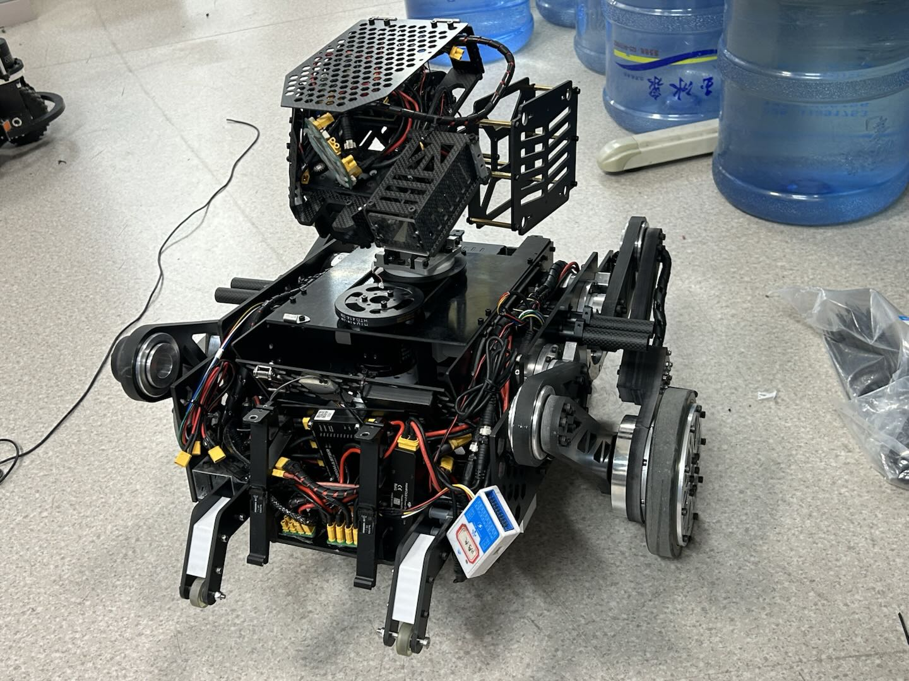

# balance_chassis

## 说明
该仓库为2025赛季轮腿代码，包括并联腿与串联腿

### 并联腿



### 使用的硬件

- 达妙 stm32h7 板

- 关节电机为宇树a1电机，轮毂电机为宇树Go-8010电机

### 安装依赖

- Cubemx 版本 6.12.0

### 一些说明

布局：

```

           右轮 1
             ^
          0  |  1
             |
正方向  <-----------> 电池
             |
          0  |  1
             v
           左轮 0

```

| 设备          | 总线   | 反馈 ID | 说明              |
| ------------- | ------ | ------- | ----------------- |
| 左轮          | rs485(uart8)   | 0x0   | left_wheel |
| 右轮          | rs485(uart8)   | 0x1   | right_wheel |
| 左前关节电机 | rs485(usart2) | 0x0    | lf_joint      |
| 左后关节电机 | rs485(usart2) | 0x1    | lb_joint      |
| 右前关节电机 | rs485(usart3) | 0x0    | rf_joint      |
| 右后关节电机 | rs485(usart3) | 0x1    | rb_joint      |
